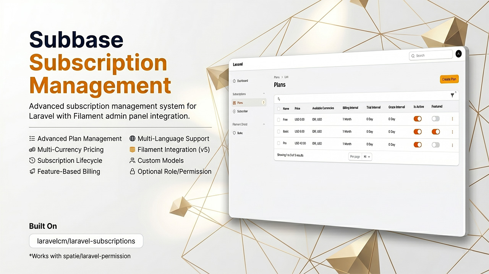
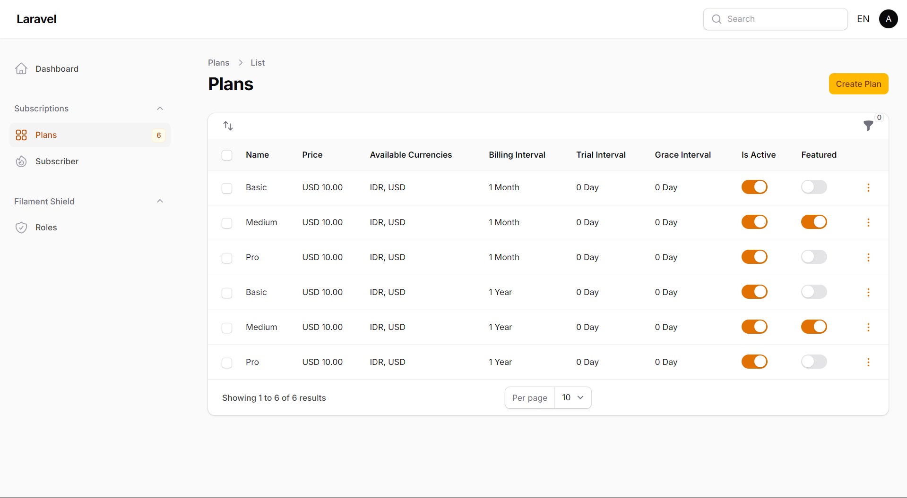
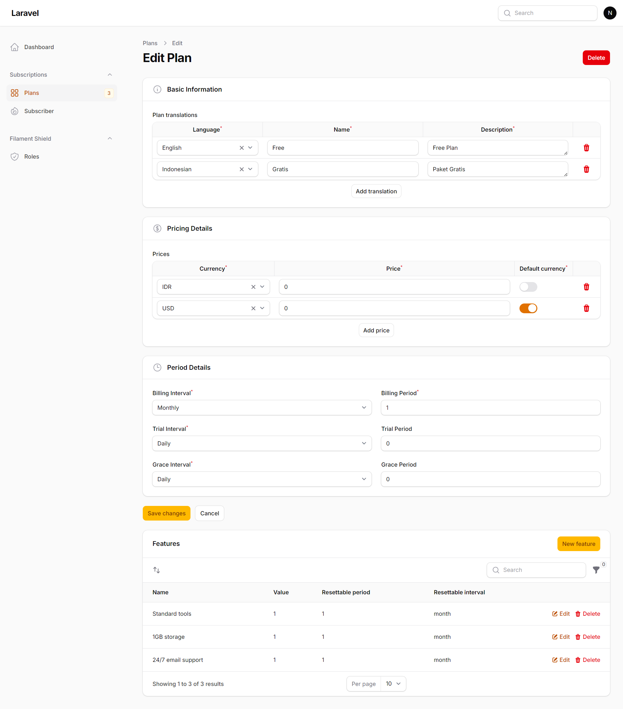
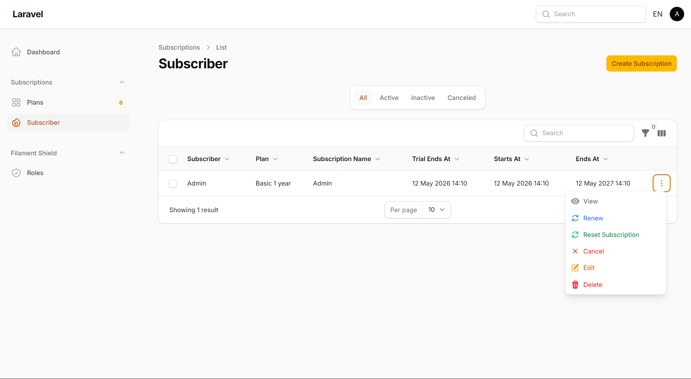
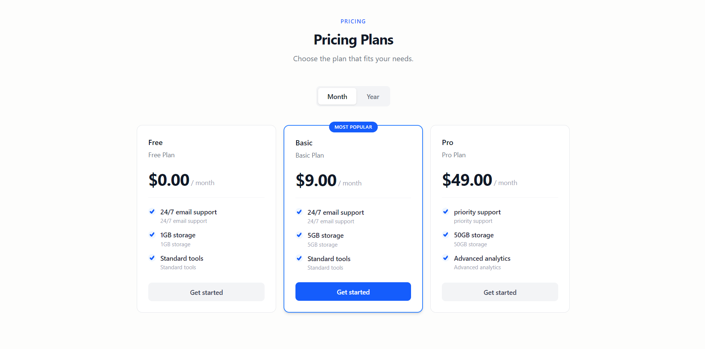

# Subbase - Filament Subscription Management Plugin

[](https://packagist.org/packages/nafiswatsiq/subbase)
[](LICENSE.md)
[](https://packagist.org/packages/nafiswatsiq/subbase)





Advanced subscription management system for Laravel with Filament admin panel integration. Built on top of [`laravelcm/laravel-subscriptions`](https://github.com/laravelcm/laravel-subscriptions) with multi-currency support, optional role/permission support, and custom model flexibility.

## Features

- 📋 **Plan Management** - Create and manage subscription plans with features
- 💰 **Multi-Currency Pricing** - Support for multiple currencies per plan
- 📅 **Subscription Lifecycle** - Full subscription state management (trial, active, canceled, expired)
- 🎯 **Feature-Based Billing** - Assign features to plans with usage tracking
- 🌍 **Multi-Language Support** - Translatable plan names, descriptions, and features
- 🎨 **Filament Integration** - Beautiful admin interface with Filament v5
- ⚙️ **Custom Models** - Use your own models extending base subscription models
- 🔐 **Optional Role Permission** - Works with `spatie/laravel-permission` when installed, but still works without it

## Requirements

- PHP 8.2+
- Laravel 13.7+
- Filament 5.0+
- laravelcm/laravel-subscriptions 1.8+

## Installation

### 1. Install via Composer

```bash
composer require nafiswatsiq/subbase
```

### 2. Publish Config & Migrations

```bash
php artisan subbase:install
php artisan migrate
```

### 3. Add Subscriptions to User model

In your User model just use trait like this:

```php
namespace App\Models;

use Laravelcm\Subscriptions\Traits\HasPlanSubscriptions;
use Illuminate\Foundation\Auth\User as Authenticatable;

class User extends Authenticatable
{
    use HasPlanSubscriptions;
}
```

### 4. Register Plugin in Filament Panel

In your `app/Providers/Filament/AdminPanelProvider.php`:

```php
use Nafiswatsiq\Subbase\SubbasePlugin;

class AdminPanelProvider extends PanelProvider
{
    public function panel(Panel $panel): Panel
    {
        return $panel
            ->plugin(SubbasePlugin::make())
            // ... rest of configuration
    }
}
```

### 5. Register Service Provider (optional, auto-discovered)

The service provider is auto-discovered via `composer.json` extra field. If auto-discovery is disabled, add manually in `bootstrap/providers.php`:

```php
Nafiswatsiq\Subbase\SubbaseServiceProvider::class,
```

## Configuration

### Default Configuration

Publish config file:

```bash
php artisan vendor:publish --tag="subbase-config"
```

Edit `config/subbase.php` to customize:
- Default currency
- Locale to currency mapping
- Language locale mapping
- Subscription table names
- Model bindings (for custom models)
- Optional permission strings

### Optional Role Permission Integration

If your app installs `spatie/laravel-permission`, you can control access to the plugin with permission names in `config/subbase.php`:

```php
'permissions' => [
    'plan' => 'manage subbase plans',
    'subscription' => 'manage subbase subscriptions',
    'feature' => 'manage subbase features',
],
```

Behavior:
- If `spatie/laravel-permission` is installed, Filament resource access follows those permission strings.
- If it is not installed, the plugin remains fully usable and permissions are ignored.
- If the permission value is left empty, Subbase falls back to Shield-style names such as `ViewAny:Plan` and `ViewAny:Subscription` for the built-in resources.

### Custom Models

Override default models in `config/subbase.php`:

```php
'models' => [
    'plan' => App\Models\CustomPlan::class,
    'feature' => App\Models\CustomFeature::class,
    'subscription' => App\Models\CustomSubscription::class,
    'subscription_usage' => App\Models\CustomSubscriptionUsage::class,
]
```

Ensure your custom models extend the base models from `nafiswatsiq/subbase`.

## Core Subscription Usage

Subbase uses `laravelcm/laravel-subscriptions` under the hood to handle all core subscription logic (subscribing, canceling, checking features, swapping plans, etc.).

For complete documentation on how to use the underlying subscription methods on your User model, please refer to the official repository:
👉 [laravelcm/laravel-subscriptions on GitHub](https://github.com/laravelcm/laravel-subscriptions)

## New Subbase Features

Subbase adds several powerful features on top of the base package:

### 1. Multi-Currency Pricing
Plans in Subbase can store prices for multiple currencies natively. Use the built-in Filament panel to set prices for `USD`, `EUR`, `IDR`, etc. The pricing component will automatically display the correct currency based on your `subbase.php` locale mappings.

**Usage Examples:**
```php
use Nafiswatsiq\Subbase\Models\Plan;

$plan = Plan::first();

// Retrieve price for a specific currency
$priceInUSD = $plan->getPriceForCurrency('USD');

// Retrieve price automatically based on application locale (e.g., 'en-US' mapped to 'USD')
// Returns the base price if the currency is not set
$priceForLocale = $plan->getPriceForLocale(app()->getLocale());

// Check if a plan has a price set for a specific currency
if ($plan->hasCurrencyPrice('EUR')) {
    // ...
}

// Get all currencies configured for the plan
$currencies = $plan->getAvailableCurrencies(); // ['USD', 'IDR', 'EUR']

// Programmatically set a price for a currency
$plan->setPriceForCurrency('EUR', 15.99)->save();
```

### 2. Featured Plans
You can mark specific plans as "Featured" (your most popular plan). 
To easily retrieve only the featured plans in your application, you can use the `featured` attribute:

```php
use Nafiswatsiq\Subbase\Models\Plan;

$plan = Plan::active()->first();
$plan->featured;
```

## Frontend Components


Subbase includes a modern, reusable Blade component built with Tailwind CSS to display pricing plans on your frontend. 

To use the pricing table in any of your Blade views, simply include the component:

```blade
<!-- You can also provide a custom route name for the subscribe button -->
<x-subbase::plan-list subscribe-route="your.custom.checkout.route" />
```
```php
// Example Route
Route::get('subscribe/{plan}', function ($plan) {
    dd($plan);
})->name('your.custom.checkout.route');
```

### Component Features
- Automatically fetches active plans and features sorted by `sort_order`.
- Displays the most popular (featured) plan prominently.
- Formats prices correctly based on the current application locale and currencies.
- Translatable using Laravel's built-in localization.
- Responsive design tailored for modern web applications.
- Built-in tabs for filtering plans by invoice interval (monthly, yearly, etc).
- **Customizable Action Route**: Pass `subscribe-route` prop to direct users to your custom checkout flow.

### Publishing the Component
If you need to customize the look and feel of the pricing table, you can publish the view file to your application. This will copy the Blade file to `resources/views/vendor/subbase/components/plan-list.blade.php`.

Run the following command:
```bash
php artisan vendor:publish --tag="subbase-views"
```

## Multi-Language Support

Translations are organized in `resources/lang/{locale}/subbase/`:
- `plan.php` - Plan-related labels
- `subscription.php` - Subscription-related labels

Override by publishing translations:

```bash
php artisan vendor:publish --tag="subbase-translations"
```

## Support

- 📖 Documentation: [GitHub Wiki](https://github.com/nafiswatsiq/subbase/wiki)
- 🐛 Issues: [GitHub Issues](https://github.com/nafiswatsiq/subbase/issues)
- 💬 Discussions: [GitHub Discussions](https://github.com/nafiswatsiq/subbase/discussions)

## License

The MIT License (MIT). Please see [License File](LICENSE) for more information.

## Credits

- Built with [Filament](https://filamentphp.com)
- Powered by [laravelcm/laravel-subscriptions](https://github.com/laravelcm/laravel-subscriptions)
- Internationalization by [Spatie Laravel Translatable](https://github.com/spatie/laravel-translatable)
