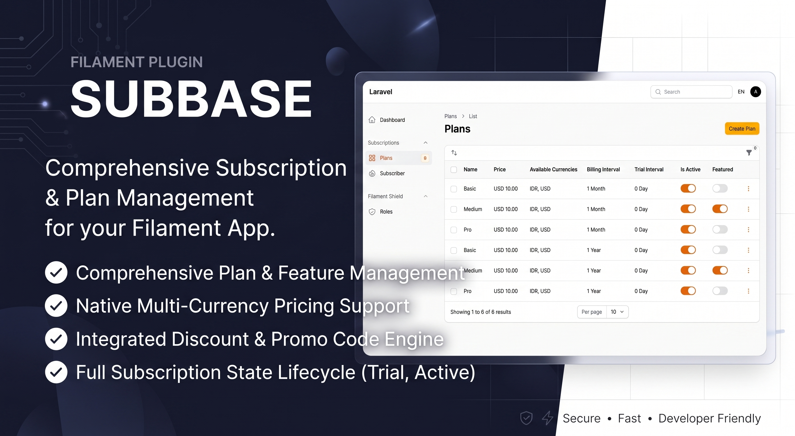
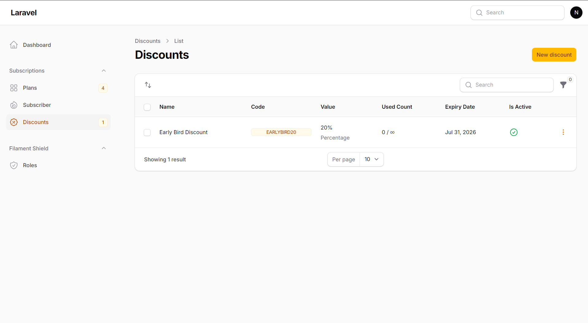
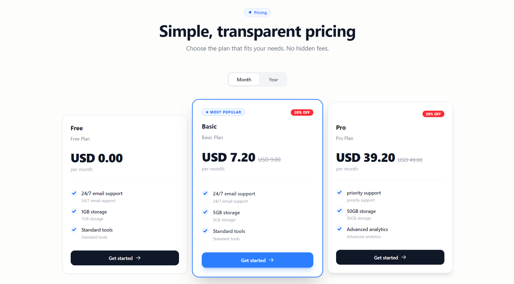

# Subbase - Filament Subscription Management Plugin

[](https://packagist.org/packages/nafiswatsiq/subbase)
[](LICENSE.md)
[](https://packagist.org/packages/nafiswatsiq/subbase)




Subbase adds a Filament admin panel and flexible pricing tools to
[`laravelcm/laravel-subscriptions`](https://github.com/laravelcm/laravel-subscriptions).
It supports multi-currency plans, discounts, translations, and custom models.

## Features

- 📋 **Plan Management** - Create and manage subscription plans with features
- 💰 **Multi-Currency Pricing** - Support for multiple currencies per plan
- 📅 **Subscription Lifecycle** - Full subscription state management (trial, active, canceled, expired)
- 🎯 **Feature-Based Billing** - Assign features to plans with usage tracking
- 💹 **Discounts & Promo Codes** - Percentage or fixed-amount discounts with validation, usage limits, and plan targeting
- 🌍 **Multi-Language Support** - Translatable plan names, descriptions, and features
- 🎨 **Filament Integration** - Beautiful admin interface with Filament v5
- ⚙️ **Custom Models** - Use your own models extending base subscription models
- 🔐 **Optional Role Permission** - Works with `spatie/laravel-permission` when installed, but still works without it

## Requirements

- PHP 8.2+
- Laravel 13.7+
- Filament 5.0+
- laravelcm/laravel-subscriptions 1.8+

## Installation

### 1. Install the package

```bash
composer require nafiswatsiq/subbase
php artisan subbase:install
php artisan migrate
```

### 2. Add subscriptions to your User model

Add the `HasPlanSubscriptions` trait:

```php
namespace App\Models;

use Laravelcm\Subscriptions\Traits\HasPlanSubscriptions;
use Illuminate\Foundation\Auth\User as Authenticatable;

class User extends Authenticatable
{
    use HasPlanSubscriptions;
}
```

### 3. Register the Filament plugin

Add `SubbasePlugin` to your panel provider:

```php
use Nafiswatsiq\Subbase\SubbasePlugin;

class AdminPanelProvider extends PanelProvider
{
    public function panel(Panel $panel): Panel
    {
        return $panel
            ->plugin(SubbasePlugin::make())
            // ... rest of configuration
    }
}
```

The service provider is auto-discovered. If auto-discovery is disabled, add it
to `bootstrap/providers.php`:

```php
Nafiswatsiq\Subbase\SubbaseServiceProvider::class,
```

### Upgrading

Use the upgrade command when updating an existing installation:

```bash
composer update nafiswatsiq/subbase
php artisan subbase:upgrade --migrations
php artisan migrate
```

Use `php artisan subbase:upgrade --config`, `--views`, or `--force` when you
need to republish those assets.

## Configuration

Publish the configuration when you need to customize defaults:

```bash
php artisan vendor:publish --tag="subbase-config"
```

The main options in `config/subbase.php` are default currency, locale
mapping, table names, model bindings, and permissions.

### Permissions

Spatie permission support is optional. When it is installed, configure resource
permissions like this:

```php
'permissions' => [
    'plan' => 'manage subbase plans',
    'subscription' => 'manage subbase subscriptions',
    'feature' => 'manage subbase features',
],
```

Behavior:
- With Spatie installed, resources use the configured permission names.
- Without Spatie, the plugin remains usable and permissions are ignored.
- Empty values use Shield-style names such as `ViewAny:Plan`.

### Custom models

Override default models in `config/subbase.php`:

```php
'models' => [
    'plan' => App\Models\CustomPlan::class,
    'feature' => App\Models\CustomFeature::class,
    'subscription' => App\Models\CustomSubscription::class,
    'subscription_usage' => App\Models\CustomSubscriptionUsage::class,
]
```

Ensure your custom models extend the base models from `nafiswatsiq/subbase`.

## Core Subscription Usage

Subbase uses `laravelcm/laravel-subscriptions` for subscribing, canceling,
feature checks, plan swaps, and other subscription operations. See the
[upstream documentation](https://github.com/laravelcm/laravel-subscriptions)
for the complete User model API.

## Feature Reference

### Multi-currency pricing

Plans can store prices for multiple ISO 4217 currencies. Use the Filament
form or the Plan API:

```php
use Nafiswatsiq\Subbase\Models\Plan;

$plan = Plan::first();
$priceInUSD = $plan->getPriceForCurrency('USD');
$priceForLocale = $plan->getPriceForLocale(app()->getLocale());
$plan->setPriceForCurrency('EUR', 15.99)->save();
```

### Discounts and promo codes

Manage discounts from the Filament resource at `/admin/discounts`. Discounts
can be percentage-based or fixed amounts, with optional dates, usage limits,
currency restrictions, and plan targeting.

```php
use Nafiswatsiq\Subbase\Models\Discount;

$discount = Discount::findByCode('NEWYEAR50');
if ($discount->isValid()) {
    $discountedAmount = $discount->calculateDiscount(100.00);
}
$discount->markUsed();
```

### Featured plans

Mark a plan as featured to highlight it in the pricing component:

```php
use Nafiswatsiq\Subbase\Models\Plan;

$plan = Plan::active()->first();
if ($plan->featured) {
    // Highlight this plan.
}
```

## Pricing Component


Use the reusable Blade component to display active plans and features:

To use the pricing table in any of your Blade views, simply include the component:

```blade
<x-subbase::plan-list />
```

When `nafiswatsiq/subbase-payment` is installed, the component automatically
uses its `subbase-payment.checkout` route. For a custom checkout flow, register
the route first and pass its name with `subscribe-route`.

To use your own checkout route, define it first and pass its route name:

```php
Route::get('subscribe/{plan}', function ($plan) {
    return view('subscribe', compact('plan'));
})->name('your.custom.checkout.route');
```

```blade
<x-subbase::plan-list subscribe-route="your.custom.checkout.route" />
```

## Optional Payment Integration

For hosted checkout and payment gateway support, install the companion
[`nafiswatsiq/subbase-payment`](https://github.com/nafiswatsiq/subbase-payment)
package. It integrates directly with Subbase plans and the `plan-list` component.

[Read the Subbase Payment documentation](https://github.com/nafiswatsiq/subbase-payment#readme)
for gateway installation, checkout configuration, webhooks, and subscription
activation through `PaymentReceived`.

### Component Features
- Fetches active plans and features sorted by `sort_order`.
- Supports featured plans, locale-aware prices, and invoice interval tabs.
- Uses the payment checkout route automatically when `subbase-payment` is installed.
- Supports custom checkout routes through `subscribe-route`.

### Publishing the Component
If you need to customize the look and feel of the pricing table, you can publish the view file to your application. This will copy the Blade file to `resources/views/vendor/subbase/components/plan-list.blade.php`.

Run the following command:
```bash
php artisan vendor:publish --tag="subbase-views"
```

## Multi-Language Support

Translations are organized in `resources/lang/{locale}/subbase/`:
- `plan.php` - Plan-related labels
- `subscription.php` - Subscription-related labels
- `discount.php` - Discount-related labels

Override by publishing translations:

```bash
php artisan vendor:publish --tag="subbase-translations"
```

## Support

- 📖 Documentation: [GitHub Wiki](https://github.com/nafiswatsiq/subbase/wiki)
- 🐛 Issues: [GitHub Issues](https://github.com/nafiswatsiq/subbase/issues)
- 💬 Discussions: [GitHub Discussions](https://github.com/nafiswatsiq/subbase/discussions)

## License

The MIT License (MIT). Please see [License File](LICENSE) for more information.

## Credits

- Built with [Filament](https://filamentphp.com)
- Powered by [laravelcm/laravel-subscriptions](https://github.com/laravelcm/laravel-subscriptions)
- Internationalization by [Spatie Laravel Translatable](https://github.com/spatie/laravel-translatable)
