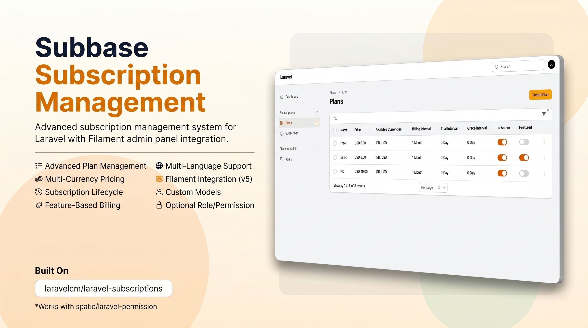

# Subbase - Filament Subscription Management Plugin

[](https://packagist.org/packages/nafiswatsiq/subbase)
[](LICENSE.md)
[](https://packagist.org/packages/nafiswatsiq/subbase)


Advanced subscription management system for Laravel with Filament admin panel integration. Built on top of [`laravelcm/laravel-subscriptions`](https://github.com/laravelcm/laravel-subscriptions) with multi-currency support, optional role/permission support, and custom model flexibility.

## Features

- 📋 **Plan Management** - Create and manage subscription plans with features
- 💰 **Multi-Currency Pricing** - Support for multiple currencies per plan
- 📅 **Subscription Lifecycle** - Full subscription state management (trial, active, canceled, expired)
- 🎯 **Feature-Based Billing** - Assign features to plans with usage tracking
- 🌍 **Multi-Language Support** - Translatable plan names, descriptions, and features
- 🎨 **Filament Integration** - Beautiful admin interface with Filament v5
- ⚙️ **Custom Models** - Use your own models extending base subscription models
- 🔐 **Optional Role Permission** - Works with `spatie/laravel-permission` when installed, but still works without it

## Requirements

- PHP 8.2+
- Laravel 13.7+
- Filament 5.0+
- laravelcm/laravel-subscriptions 1.8+

## Installation

### 1. Install via Composer

```bash
composer require nafiswatsiq/subbase
```

### 2. Publish Config & Migrations

```bash
php artisan subbase:install
php artisan migrate
```

### 3. Add Subscriptions to User model

In your User model just use trait like this:

```php
namespace App\Models;

use Laravelcm\Subscriptions\Traits\HasPlanSubscriptions;
use Illuminate\Foundation\Auth\User as Authenticatable;

class User extends Authenticatable
{
    use HasPlanSubscriptions;
}
```

### 4. Register Plugin in Filament Panel

In your `app/Providers/Filament/AdminPanelProvider.php`:

```php
use Nafiswatsiq\Subbase\SubbasePlugin;

class AdminPanelProvider extends PanelProvider
{
    public function panel(Panel $panel): Panel
    {
        return $panel
            ->plugin(SubbasePlugin::make())
            // ... rest of configuration
    }
}
```

### 5. Register Service Provider (optional, auto-discovered)

The service provider is auto-discovered via `composer.json` extra field. If auto-discovery is disabled, add manually in `bootstrap/providers.php`:

```php
Nafiswatsiq\Subbase\SubbaseServiceProvider::class,
```

## Configuration

### Default Configuration

Publish config file:

```bash
php artisan vendor:publish --tag="subbase-config"
```

Edit `config/subbase.php` to customize:
- Default currency
- Locale to currency mapping
- Language locale mapping
- Subscription table names
- Model bindings (for custom models)
- Optional permission strings

### Optional Role Permission Integration

If your app installs `spatie/laravel-permission`, you can control access to the plugin with permission names in `config/subbase.php`:

```php
'permissions' => [
    'plan' => 'manage subbase plans',
    'subscription' => 'manage subbase subscriptions',
    'feature' => 'manage subbase features',
],
```

Behavior:
- If `spatie/laravel-permission` is installed, Filament resource access follows those permission strings.
- If it is not installed, the plugin remains fully usable and permissions are ignored.
- If the permission value is left empty, Subbase falls back to Shield-style names such as `ViewAny:Plan` and `ViewAny:Subscription` for the built-in resources.

### Custom Models

Override default models in `config/subbase.php`:

```php
'models' => [
    'plan' => App\Models\CustomPlan::class,
    'feature' => App\Models\CustomFeature::class,
    'subscription' => App\Models\CustomSubscription::class,
    'subscription_usage' => App\Models\CustomSubscriptionUsage::class,
]
```

Ensure your custom models extend the base models from `nafiswatsiq/subbase`.

## Multi-Language Support

Translations are organized in `resources/lang/{locale}/subbase/`:
- `plan.php` - Plan-related labels
- `subscription.php` - Subscription-related labels

Override by publishing translations:

```bash
php artisan vendor:publish --tag="subbase-translations"
```

## Support

- 📖 Documentation: [GitHub Wiki](https://github.com/nafiswatsiq/subbase/wiki)
- 🐛 Issues: [GitHub Issues](https://github.com/nafiswatsiq/subbase/issues)
- 💬 Discussions: [GitHub Discussions](https://github.com/nafiswatsiq/subbase/discussions)

## License

The MIT License (MIT). Please see [License File](LICENSE) for more information.

## Credits

- Built with [Filament](https://filamentphp.com)
- Powered by [laravelcm/laravel-subscriptions](https://github.com/laravelcm/laravel-subscriptions)
- Internationalization by [Spatie Laravel Translatable](https://github.com/spatie/laravel-translatable)
